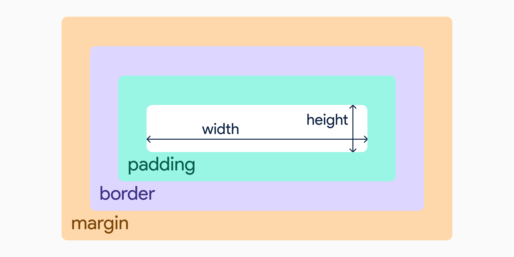
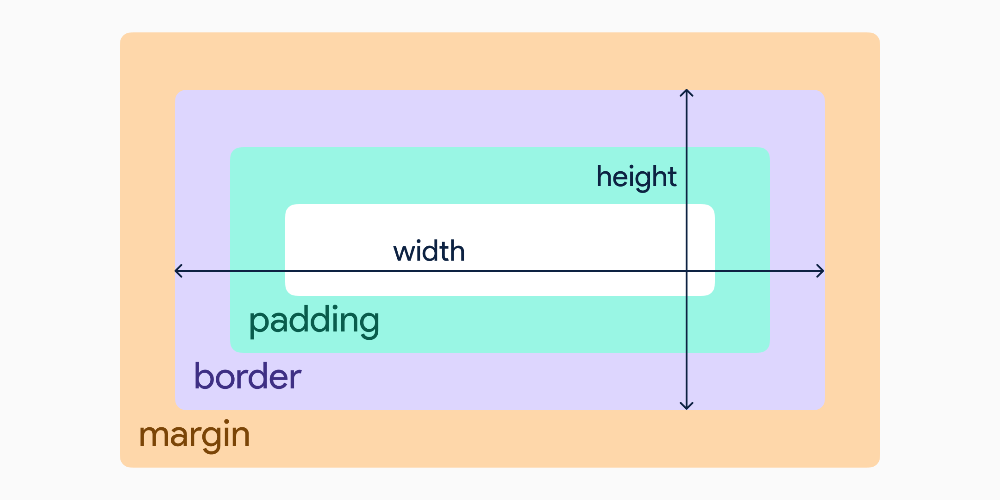

只在初学时系统了解过 CSS，但当时缺乏实战经验，一些示例看得云里雾里。这么久时间过去了，CSS 概念忘得差不多了，成了开发时的麻烦来源，所以复习进阶是很有必要的。这个系列的内容摘自”[《深入解析 CSS》基思·J·格兰特 著，黄小璐，高楠 译](https://e.jd.com/30618077.html)“一书，摘取了书中的核心概念讲解，去掉了示例的部分，适合作为 CSS 使用手册。

## 层叠、优先级与继承

### 1. 层叠

CSS 的本质是声明规则：即在各种条件下，产生特定的效果。层叠是指当不同的声明产生冲突时如何解决冲突的规则。

当声明产生冲突时，层叠会依据三种条件解决冲突：

1. 样式表的来源：作者（开发者）样式、用户样式、浏览器默认样式。
2. 选择器优先级：行内样式、id 选择器、类、伪类、标签选择器、元素、伪元素选择器。
3. 源码顺序：CSS 声明的顺序：晚声明的优先于早声明的。

#### 优先级标记

选择器的优先级通常用一组数值表示，用逗号隔开。比如“(1, 2, 2)”表示选择器由 1 个 ID、2 个类、2 个标签组成。

**层叠最佳实践**：

1. 在选择器中不要使用 ID。就算只用一个 ID，也会大幅提升选择器的优先级，当需要覆盖这个样式时，通常找不到另一个有意义的 ID。
2. 除非万不得已，否则永远不要使用`!important`，它比 ID 更难覆盖。

### 2. 继承

如果一个元素的某个属性没有层叠值，则可能会继承某个祖先元素的值。

只有特定的一些属性可以被继承，通常与文本相关：color、font、font-family、font-size、font-weight、font-variant、font-style、line-height、letter-spacing、text-align、text-indent、text-transform、white-space、word-spacing。

还有一些其他的属性也可以被继承，比如列表属性：list-style、list-style-type、list-style-position、list-style-image。

可以在适当的场景使用继承，比如在 body 中设置 font-family 属性，将字体应用于整个网页。

### 3. 特殊值

有两个特殊值可以赋值给任意属性，用于控制层叠：inherit 和 initial。

#### inherit

有时，我们想用继承代替层叠，这时可以用 inherit 关键字，这样该元素就会继承父元素的值。

可以使用 inherit 强制继承一个本不可以继承的属性，比如 border 或 padding，但通常很少这样做。

#### initial

有时，需要撤销作用于某个元素的样式（通常来自层叠和继承），这时可以使用 initial 关键字。每一个 CSS 属性通常都会有一个默认值，initial 会将属性重置为默认值。

### 4. 简写属性

如 background、font 等简写属性隐藏了一些怪异行为：

#### 4.1 简写属性会默默覆盖其他样式

大多数简写属性可以省略一些值，但这样做会隐式地将省略的值设置为默认值，这会覆盖在其他地方定义的样式。

#### 4.2 简写值的顺序

当遇到 margin、padding 这样的属性时，简写值的顺序为：上、右、下、左。

---

## 相对单位

与传统的印刷设计不同，在 Web 环境下，用户可以自行设置浏览器窗口大小、字体大小，可以自由缩放网页。因此不能在创建网页时就应用样式，而是要等到网页渲染完成再去计算样式。这为 CSS 增加了一个抽象层，浏览器会根据相对单位计算出最终的绝对值。

### 1. em 和 rem

#### em 相对于当前元素（继承）的字体大小。

当 em 被用于字体大小时，会根据当前元素的继承值来计算最终值，当 em 被用于其他属性时，会根据当前元素的字体大小计算最终值。

所以当同时将 em 用于字体大小和其他属性时，浏览器的计算顺序为：先计算该元素的字号，再根据该元素的字号计算其他使用 em 的属性。

#### rem 相对于 root 元素的字体大小。

在 DOM 中，根节点（html）有一个伪类:root，:root 等价于 html，但:root 的优先级是类，大于 html（标签）。

rem 是 root em 的缩写，不管在文档的何处使用 rem，都会依据根元素的字体大小计算最终值。通常根元素的字体大小为浏览器默认的 16px。

**一个不错的最佳实践**：使用 rem 设置字体大小，使用 px 设置框线，使用 em 设置其他属性（margin，padding 等）。

### 2. 停止像素思维

有一个流传至今的反模式，即将网页根元素的字体大小设置为 0.625rem 或 62.5%。

这样做的优点在于能简化计算：当设计师希望字号为 14px，只要在心里默默处以 10，写 1.4rem 就可以了。

这样一开始会很方便，但麻烦和缺点马上就来了：

1. 10px 对于大部分文字来说实在太小了，最终会为覆盖默认大小而写很多多余的代码。而且在 chrome 等浏览器中，最小字体大小限制为 12px，如果使用这种模式，通常会产生一些错乱。
2. 这种做法的本质还是像素思维。虽然代码里写的是 1.4rem，心里默念的却还是 14px。在响应式设计中，要习惯“模糊”值。

### 3. viewport 的相对单位

- vh: viewport 高度的 1/100
- vw: viewport 高度的 1/100
- vmin: viewport 的宽度和高度中较小的一方
- vmax: viewport 的宽度和高度中较大的一方

#### 使用 vw 定义字体大小

使用 vw 定义字体大小的好处在于字体会随着 viewport 宽度的变化而平滑过渡，而不会在断点出突然改变。不幸的是默认情况下大屏和小屏的 viewport 宽度差距过大，为了能保留这种缩放的能力，我们可以借助 CSS 的`calc()`函数。

```css
:root {
  font-size: calc(0.5em + 1vw);
}
```

可以按照喜好调节这个值，这样我们不通过媒体查询就实现了响应式策略。

### 4. 无单位的数值和行高

有些属性允许无单位的值，包括 line-height、z-index、font-weight（700 等于 bold、400 等于 regular），任何长度单位都接受无单位的 0。

line-height 属性比较特殊，它的值既可以有单位也可以无单位，通常我们应该使用无单位的值。

使用无单位值的行高会根据字体大小计算（字体大小 \* 行高）。

使用有单位的行高可能会导致文字重叠。这源于 CSS 继承的一个怪异特性：当一个元素的值被定义为长度（px、em、rem 等）时，子元素会继承它的最终值。当使用 em 指定行高时，如果子元素有不同的字体大小，并继承了该行高，则可能会产生文字重叠。

而使用无单位的行高时，继承的为声明值而不是最终值，这是我们想要的结果。

### 5. CSS 变量

CSS 变量要远比 Sass 或 less 这样的预处理器提供的变量强大得多。

#### 定义 CSS 变量

可以使用`--`前缀来定义 CSS 变量，CSS 变量可以在任意作用域定义，最常见的用法是在:root 上定义 CSS 变量，子元素可以通过继承访问变量：

```css
:root {
  --gray-400: #a1a1aa;
  --gray-500: #71717a;
  --gray-600: #52525b;
}
```

#### 使用 CSS 变量

借助`var()`函数访问 CSS 变量的值：

```css
.title {
  color: var(--gray-500);
}
```

`var()`函数接受第二个参数，当第一个参数为未定义时，使用第二个参数作为备用值。

> 如果 var()函数计算出来的是一个非法值，则对应的属性会被重置为默认值。

#### 动态改变 CSS 变量

贴上我的博客的 Dark Mode 实现（部分代码）：

```css
:root {
  --text-primary: var(--gray-800);
  --text-secondary: var(--gray-500);
  --text-tertiary: var(--gray-400);
  --bg-primary: white;
  --bg-secondary: var(--gray-100);
  --line: var(--gray-200);
  --text-bg-selected: rgba(20, 184, 166, 0.2);
}

:root.dark {
  --text-primary: white;
  --text-secondary: var(--gray-400);
  --text-tertiary: var(--gray-500);
  --bg-primary: var(--gray-800);
  --bg-secondary: var(--gray-900);
  --line: var(--gray-600);
}
```

使用 JavaScript 控制 html 元素的`.dark`类名即可动态改变 CSS 变量的值。

#### 使用 JavaScript 操作 CSS 变量

```js
const rootElement = document.documentElement
rootElement.style.setProperty('--gray-500', '#fff')
```

---

## 盒模型

盒模型决定了网页元素的大小和位置的基本规则。

### 1. 元素宽度的问题

当给一个元素设置宽高时，指定的是内容（content）的宽高，所有的 padding、border、margin 都是追加到该高度上的。



这种行为会让一个宽为 300px、padding 为 10px、border 为 1px 的元素最终渲染为宽 322px，如果这些值使用不同的单位，情况会更加复杂。

#### 避免使用魔术数值

最笨的方法是在宽高中减去 padding、border 所占的长度，但这种做法会产生魔术数值（magic number），它是一个不理想的值，不利于维护。

#### 调整盒模型

可以使用 box-sizing 属性调整盒模型的行为。box-sizing 的默认值为 content-box，这意味着任何指定的宽和高都将只设置 content 的大小。将 box-sizing 设置为 border-box 之后，height 和 width 会包含 padding 和 border。



虽然 border-box 并不是默认属性，但事实上 border-box 有更好的可预测性，更符合正常的心智模型。譬如点击 padding 部分也会触发元素上的点击事件，而使用默认的 content-box 免不了会产生迷惑行为。人们也更容易接受“内边距（padding）”处于宽度和高度之内，用于控制盒子内元素到盒子边框的距离。

> 将 box-sizing 设置为 border-box 早已是普遍做法和最佳实践。

### 2. 元素高度的问题

处理元素高度的方式跟处理宽度不一样，之前对 border-box 的修改同样适用于高度，而且很有用，但最好避免给元素指定明确的高度。**普通文档流是为限定的宽度和无限的高度设计的**。内容为填满视口的宽度，并在必要时折行。因此容器的高度并不是指定的，而是天然地决定。

> 普通文档流指网页元素的默认布局行为，行内元素从左到右排列，到达容易边缘换行。块级元素则占满整行，前后都有换行。

#### 实现等高列

实现等高列最好的办法是让它们自己决定高度，然后扩展较矮的列，让它的高度等于较高的列。

使用 CSS 表格：

首先将容器设置`display: table`，然后给每一列设置`display: table-cell`。

不像默认的 block 元素，`display: table`的元素并不会将宽度扩展至 100%，因此需要明确指定宽度。

使用表格元素的 border-spacing 属性定义单元格的间距，但会导致这个边距被应用于表格的外边缘。通常的解决办法是在容器盒子之外包裹一个设有负 margin 的盒子。

使用 Flex box：

将容器设置`display: flex`，它就变成了一个弹性容器，子元素是默认等高的。

> 除非别无选择，否则不要明确设定元素的高度，先寻找一个替代方案。设置高度一定会导致更复杂的情况。

#### 实现垂直居中

垂直居中一直是 CSS 中一个令人头疼的难题，过去有好几种实现垂直居中的方式，但每一种都有一定的局限性。

一个不好的做法是给容器指定一个高度，然后试图让动态大小的内部元素居中。

CSS 中最简单的垂直居中是给容器相等的上下 padding，让容器和内容自行决定高度。

```css
/* ⛔️ 请不要模仿！！！这是很糟糕的方式。 */
header {
  padding: 4em 0;
  color: #fff;
  background-color: #0072b0;
  border-radius: 0.5em;
}
```

如果没有兼容性的负担，使用 Flex box 实现垂直居中是最优雅的方式：

```css
/* ✅ */
.container {
  display: flex;
  justify-content: center;
  align-items: center;
}
```

> 垂直居中指南：
>
> 使用一个自然高度的容器：给容器加上相等的上下内边距让内容居中。
>
> 容器需要指定高度或者避免使用内边距：对容器使用`display: table-cell`和`vertical-align: middle`。
>
> 没有兼容性的负担：使用 Flex box。
>
> 容器中只有一行文字：设置一个大的行高，使行高等于理想的容器高度。如果容器不是行内元素，可以设置`inline-block`。
>
> 容器的宽高都确定：使用绝对定位。（当前面的方法都无效时再考虑）。

### 3. 负 margin

负 margin 的行为取决于设置在元素的哪边：

- 如果设置左边或上边的 margin 为负，元素会相应向左或向上移动。
- 如果设置右边或下边的 margin 为负，元素并不会移动，而是会将它后面的元素拉过来。

负边距并不常用，但在某些场景下特别实用，尤其是创建列布局的时候。不过应当避免频繁使用，不然网页的样式会失控。

### 4. margin 折叠

当顶部和/或底部的 margin 相邻时，就会重叠，产生单个 margin。折叠 margin 的大小等于相邻的 margin 中的最大值。

margin 折叠就像是“个人空间”。如果公交车站站着两个人，他们每个人都认为较为舒适的个人空间为 1 米，那么他们就乐意间隔 1 米，而不必间隔 2 米。

在正常的文档流中这很有用，可以让你放心设置 margin 而无需在意它前后的元素是否已经有 margin。

> 只有上下会产生折叠，左右不会。

如下方法可以防止 margin 折叠：

- 对容器使用`overflow: auto`（或者其他非 visible 的值），防止内部元素的 margin 跟容器外部的 margin 重叠，这种方式副作用最小。
- 在两个 margin 之间加上 border 或 padding，防止它们折叠。
- 如果容器为 float、inline-block、absolute 或 fixed，margin 不会在它外面折叠。
- 使用 Flex box 时，不会产生折叠。
- 元素为`display: table-cell`时不具备 margin 属性，因此不会折叠，此外还有 table-row 和其他大部分表格类型 display，但不包括 table、table-inline、table-caption。

这些方法中很多会改变元素的布局行为，除非这些行为是你想要的，否则不要轻易使用。

## 总结

- 控制选择器的优先级。
- 不要混淆层叠和继承。
- 某些属性会被继承，通常和文本相关。
- 不要混淆 initial 和 auto。
- 简写值要注意顺序。
- 拥抱相对单位，让网页的结构决定样式的含义。
- 使用无单位的值设置行高。
- 总是全局设置 border-box。
- 避免明确设置高度。
- 尽量使用现代的布局技术（Flex box）实现垂直居中。
- 如果 margin 很奇怪，就采取措施防止 margin 折叠。
