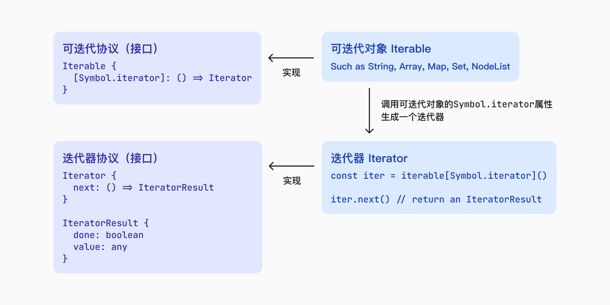

## 1. 理解迭代

迭代就是按照顺序反复多次执行一段程序。

在 Javascript 中，计数循环是一种最简单的迭代：

```jsx
for (let i = 0; i < 10; i++) {
  console.log(i)
}
```

迭代会在一个**有序集合**上进行，数组是有序集合最典型的例子。

> 由于如下原因，通过循环来执行迭代的方式并不理想：
>
> - 迭代之前需要知道如何使用数据结构
>
> - 遍历顺序并不是数据结构所固有的

ES5 新增了`Array.prototype.forEach()`方法，向通用迭代需求迈进了一步（但仍不够理想）。

## 2. 迭代器模式

迭代器模式描述了一个方案，即可以把有些数据结构称为“**可迭代对象（Iterable）**”，这些结构实现了正式的 Iterable 接口，可以通过**迭代器（Iterator）**消费。

迭代器是按需创建的一次性对象。每个**迭代器**都会关联一个**可迭代对象，迭代器**会暴露其关联的**可迭代对象**的 API。

迭代器无须关心可迭代对象的结构，只需要知道如何获取值，因而实现了**可迭代对象**与**迭代器**的概念分离。



### 2.1 可迭代协议

实现 Iterable 接口（可迭代协议）要求同时具备两种能力：

1. 支持迭代的自我识别能力
2. 创建实现迭代器的能力

在 ECMAScript 中，使用一个特殊的属性作为“默认迭代器”，这个属性以`Symbol.iterator`作为 key，这个默认迭代器属性引用一个工厂函数，调用这个工厂函数将返回一个新的迭代器。

以下内置类型实现了 Iterable 接口：

`String, Array, Map, Set, arguments, NodeList(DOM)`

可以暴露这个工厂函数来检查是否存在迭代器属性：

```jsx
// 未实现默认迭代器属性
const num = 1
console.log(num[Symbol.iterator]) // undefined
const obj = {}
console.log(obj[Symbol.iterator]) // undefined

// 实现了默认迭代器属性
const str = 'abc'
console.log(str[Symbol.iterator]) // f values() { [native code] }
const arr = [1, 2, 3]
console.log(arr[Symbol.iterator]) // f values() { [native code] }
const map = new Map().set('a', 1).set('b', 2).set('c', 3)
console.log(map[Symbol.iterator]) // f values() { [native code] }
const set = new Set().add('a').add('b').add('c')
console.log(set[Symbol.iterator]) // f values() { [native code] }
const els = document.querySelectorAll('div')
console.log(els[Symbol.iterator]) // f values() { [native code] }
```

在实际编程中，不需要显式调用这个工厂函数来生成迭代器。实现可迭代协议的所有类型都会自动兼容接收可迭代对象的任何语言特性，包括：

- for-of 循环
- 数组解构
- 扩展操作符
- `Array.from()`
- 创建 Map
- 创建 Set
- `Promise.all()`接收由期约组成的可迭代对象
- `Promise.race()`接收由期约组成的可迭代对象
- `yield*`操作符，在生成器中使用

这些原生特性会在后台调用工厂函数来创建生成。

### 2.2 迭代器协议

迭代器是一种一次性使用的对象，用于迭代与其关联的可迭代对象。

迭代器 API 使用`next()`方法在可迭代对象中遍历数据。每次成功调用`next()`，都会返回一个 IteratorResult 对象，其中包含了迭代器返回的下一个值。若不调用`next()`，则无法知道迭代器的当前位置。

IteratorResult 对象包含两个属性：

`done: Boolean` 表示是否还可以继续调用`next()`取得下一个值

`value: any` 表示可迭代对象的下一个值，done 为 true 时为 undefined

```jsx
// 可迭代对象
const iterable = ['foo', 'bar']
// 迭代器工厂函数
console.log(iterable[Symbol.iterator]) // f values() { [native code] }
// 迭代器
const iter = iterable[Symbol.iterator]() // ArrayIterator()
// 执行迭代
console.log(iter.next()) // {value: 'foo', done: false}
console.log(iter.next()) // {value: 'bar', done: false}
console.log(iter.next()) // {value: undefined, done: true}
```

不同的迭代器实例之间没有关系，各自独立遍历可迭代对象：

```jsx
const iter1 = iterable[Symbol.iterator]()
const iter2 = iterable[Symbol.iterator]()
iter1.next()
console.log(iter1.next()) // {value: 'bar', done: false}
console.log(iter2.next()) // {value: 'foo', done: false}
```

迭代器并不是可迭代对象某一个时刻的快照，如果迭代期间可迭代对象被修改，迭代器也会发生相应变化：

```jsx
let arr1 = ['foo', 'baz']
const iter3 = arr1[Symbol.iterator]()
console.log(iter3.next()) // {value: 'foo', done: false}
arr1.splice(1, 0, 'bar')
console.log(iter3.next()) // {value: 'bar', done: false}
```

显式的迭代器实现与原生迭代器的区别：

```jsx
// 这个类实现了可迭代接口(Iterable)
class Foo {
  [Symbol.iterator]() {
    return {
      next() {
        return { done: false, value: 'foo' }
      },
    }
  }
}

// 显式的迭代器实现
const f = new Foo()
console.log(f[Symbol.iterator]()) // { next: f() }

// 原生的迭代器实现
const a = new Array()
console.log(a[Symbol.iterator]()) // Array Iterator {}
```

### 2.3 自定义迭代器

与 Iterable 接口类似，任何实现 Iterator 接口的对象都可作为迭代器使用。

```jsx
// 自定义迭代器
class Counter {
  constructor(limit) {
    this.count = 1
    this.limit = limit
  }

  next() {
    if (this.count < this.limit) {
      return { done: false, value: this.count++ }
    } else {
      return { done: true, value: undefined }
    }
  }

  [Symbol.iterator]() {
    return this
  }
}

const counter = new Counter(3)

for (let i of counter) {
  console.log(i)
}
// 2
// 3
```

这个类实现了 Iterator 接口，但并不理想，它的每个实例都只能被迭代一次：

```jsx
for (let i of counter) {
  console.log(i)
}
// (nothing logged)
```

为了让一个可迭代对象能够创建多个迭代器，必须每创建一个迭代器就对应一个新的计数器，为此可以把计数器变量放到闭包里，通过闭包返回迭代器：

```jsx
class Counter1 {
  constructor(limit) {
    this.limit = limit
  }

  [Symbol.iterator]() {
    let count = 1
    let limit = this.limit
    return {
      next() {
        if (count <= limit) {
          return { done: false, value: count++ }
        } else {
          return { done: true, value: undefined }
        }
      },
    }
  }
}

const counter1 = new Counter1(3)

for (let i of counter1) {
  console.log(i)
}
// 1
// 2
// 3

for (let i of counter1) {
  console.log(i)
}
// 1
// 2
// 3
```

### 2.4 提前终止迭代器

可选的`return()`方法用于指定在迭代器提前关闭时执行的逻辑。以下情况会提前终止迭代：

- for-of 循环通过`break`、`continue`、`return`或`throw`提前退出
- 解构操作并未消费所有值

`return()`方法必须返回一个有效的 IteratorResult 对象。

内置语言结构在后台调用`return()`方法：

```jsx
class Counter2 {
  constructor(limit) {
    this.limit = limit
  }

  [Symbol.iterator]() {
    let count = 1
    let limit = this.limit
    return {
      next() {
        if (count <= limit) {
          return { done: false, value: count++ }
        } else {
          return { done: true, value: undefined }
        }
      },
      return() {
        console.log('Exiting early')
        return { done: true }
      },
    }
  }
}

const counter2 = new Counter2(3)

for (let i of counter2) {
  if (i > 2) {
    break
  }
  console.log(i) // Exiting early
}

const counter21 = new Counter2(5)

try {
  for (let i of counter21) {
    if (i > 2) {
      throw 'err'
    }
    console.log(i) // Exiting early
  }
} catch (err) {}

const counter22 = new Counter2(5)
const [a0, b0] = counter22
// Exiting early
```

如果迭代器没有被关闭，则还可以从上次离开的地方继续迭代：

```jsx
const arr2 = [1, 2, 3, 4, 5]
const iter4 = arr2[Symbol.iterator]()

for (let i of iter4) {
  console.log(i)
  if (i > 2) {
    break
  }
}
// 1
// 2
// 3
console.log(iter4.next()) // {value: 4, done: false}
```

给不可提前终止的迭代器添加`return()`方法并不会使之变得可提前终止：

```jsx
const arr3 = [1, 2, 3, 4, 5]
const iter5 = arr3[Symbol.iterator]()
iter5.return = function () {
  return { done: true }
}
```

## 3.生成器

### 3.1 生成器基础

生成器的形式就是一个函数，在函数名称之前加一个`*`表示它是一个生成器，可以定义函数的地方就可以定义生成器。

```jsx
function* generatorFn() {}

const generatorFn = function* () {}

const foo = {
  *generator() {},
}

class Foo {
  *generator() {}
}

class Bar {
  static *generatorFn() {}
}
```

> 箭头函数不能定义生成器

调用生成器函数将返回一个生成器对象。生成器对象一开始处于暂停执行（suspended）的状态。与迭代器相类似，生成器对象也实现了 Iterable 接口，因此具有`next()`方法。调用这个方法会让生成器开始或恢复执行。

```jsx
// 生成器函数
function* generatorFn() {}

// 生成器实例
const g = generatorFn()

console.log(g) // generatorFn {<suspended>}
console.log(g.next) // ƒ next() { [native code] }
console.log(g.next()) // {value: undefined, done: true}
```

`value`属性是生成器函数的返回值，默认为`undefined`，可通过生成器函数的返回值指定：

```jsx
function* generatorFn2() {
  return 'foo'
}

const g2 = generatorFn2()
console.log(g2.next()) // foo
```

生成器对象实现了 Iterable 接口，它们默认的迭代器是自引用的：

```jsx
console.log(generatorFn2) // f* generatorFn2
console.log(generatorFn2()[Symbol.iterator]) // f [Symbol.iterator]() { [native code] }
console.log(generatorFn2())
console.log(generatorFn2()[Symbol.iterator]())
```

### 3.2 通过 yield 中断执行

`yield`关键字可以让生成器停止和开始执行，遇到`yield`之后，执行会停止，函数作用域的状态会被保留，只能通过`next()`方法来继续执行：

```jsx
function* generatorFn3() {
  yield
}

const g3 = generatorFn3()
console.log(g3.next()) // {value: undefined, done: false}
console.log(g3.next()) // {value: undefined, done: true}
```

yield 生成的值会出现在`next()`方法返回的对象里：

```jsx
function* generatorFn4() {
  yield 'foo'
  yield 'bar'
  return 'baz'
}

const g4 = generatorFn4()
console.log(g4.next()) // {value: 'foo', done: false}
console.log(g4.next()) // {value: 'bar', done: false}
console.log(g4.next()) // {value: 'baz', done: true}
```

生成器对象之间互不影响：

```jsx
const g41 = generatorFn4()
const g42 = generatorFn4()

console.log(g41.next()) // {value: 'foo', done: false}
console.log(g42.next()) // {value: 'foo', done: false}
console.log(g42.next()) // {value: 'bar', done: false}
console.log(g41.next()) // {value: 'bar', done: false}
```

1. **生成器**可作为**可迭代对象**供**迭代器**消费：

```jsx
for (const x of generatorFn4()) {
  console.log(x)
}
```

1. 使用`yield`实现输入和输出：

```jsx
function* generatorFn5(initial) {
  console.log(initial)
  console.log(yield)
  console.log(yield)
}

const g5 = generatorFn5('foo')
g5.next('bar') // foo 第一次传入的‘bar’不会被调用，因为这一次调用是为了开始执行生成器函数
g5.next('baz') // baz
g5.next('qux') // qux
```

`yield`关键字可同时用于输入和输出：

```jsx
function* generatorFn6() {
  return yield 'foo'
}

const g6 = generatorFn6()
console.log(g6.next()) // {value: 'foo', done: false}
console.log(g6.next('bar')) // {value: 'bar', done: true}
```

1. 产生可迭代对象

可以使用`*`增强`yield`

```jsx
function* generatorFn7() {
  yield* [0, 1, 2, 3, 4]
}

for (const x of generatorFn7()) {
  console.log(x)
}
```

`yield*` 返回`done: true`时的`value`属性，对于普通迭代器来说，这个值是`undefined`

```jsx
function* generatorFn8() {
  console.log('iter value:', yield* [0, 1, 2]) // iter value: undefined
}

for (const x of generatorFn8()) {
  console.log('value:', x)
}
// 0
// 1
// 2
```

对于生成器函数产生的迭代器来说，这个值就是生成器函数的返回值

```jsx
function* innerGeneratorFn() {
  yield 'foo'
  return 'bar'
}

function* outerGeneratorFn() {
  console.log('iter value:', yield* innerGeneratorFn()) // 'bar'
}

for (const x of outerGeneratorFn()) {
  console.log('value:', x) // 'foo'
}
```

### 3.3 生成器作为默认迭代器

```
class Foo1 {
  constructor() {
    this.values = [1, 2, 3]
  }

  *[Symbol.iterator]() {
    yield* this.values
  }
}

const f1 = new Foo1()
for (const x of f1) {
  console.log(x)
}
```

### 3.4 提前终止生成器

```jsx
function* generatorFn9() {
  for (const x of [1, 2, 3]) {
    yield x
  }
}
const g9 = generatorFn9()
console.log(g9.next) // ƒ next() { [native code] }
console.log(g9.return) // ƒ return() { [native code] }
console.log(g9.throw) // ƒ throw() { [native code] }

// return()
console.log(g9.return(4)) // {value: 4, done: true}

// throw()
const g91 = generatorFn9()

// 如果生成器内部处理了错误，则生成器继续执行，否则生成器结束
try {
  g9.throw('foo')
} catch (e) {
  console.log(e)
}
```
